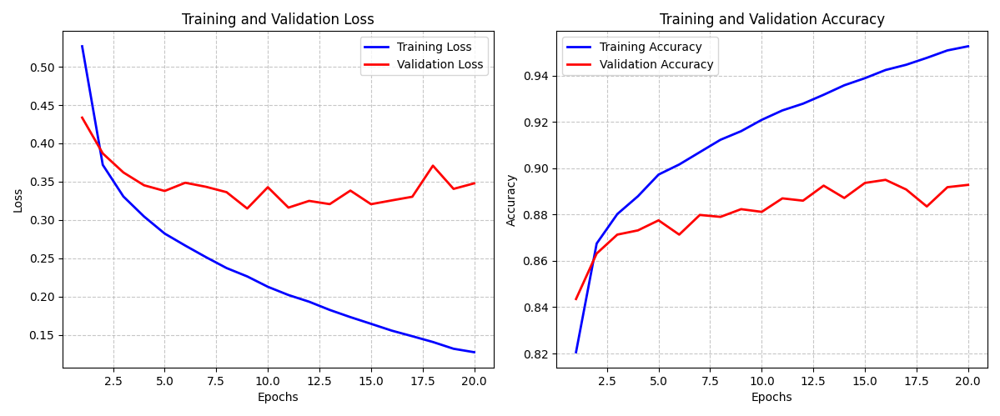

# Fashion


El objetivo de este proyecto será utilizar el dataset incluido en `keras` llamado `fashion_mnist` y crear una red neuronal capaz de identificar las diferentes prendas de ropa incluidas en este dataset.

Además, implementar técnicas de `hypertunning` a través de la librería `keras tuner`.


## Preprocesamiento

### Visualizacion del conjunto de datos

En las primeras observaciones del conjunto, encontramos lo siguiente:

```
Shape del conjunto de entrenamiento
(60000, 28, 28)
(60000,)
Shape del conjunto de entrenamiento
(10000, 28, 28)
(10000,)
```

El conjunto de entrenamiento cuenta con 60.000 registros de matrices de 28x28.\
El conjunto de test cuenta con 10.000 registros de matrices de 28x28.


Las imagenes cuentan con el siguiente formato:


```
[  0   0   0   0   0   0   0   0   0   1   0   0  18 107 119 103   9   0
    0   0   0   0   0   0   0   0   0   0]
```

28 filas, donde cada fila cuenta con valores enteros entre 0 y 255 que representa la escala de gris.

Sabemos que cada registro de matrix de 28x28 representa una prenda de moda. Para revisarlo, creamos una funcion para graficar usando `matplotlib` y encontramos lo siguiente:


Los targets son enteros entre 0 y 9:

```
9    6000
0    6000
3    6000
2    6000
7    6000
5    6000
1    6000
6    6000
4    6000
8    6000

```

Cada target se corresponde con lo siguiente:

```
0: T-shirt/top (Camiseta/parte superior)
1: Trouser (Pantalón)
2: Pullover (Jersey)
3: Dress (Vestido)
4: Coat (Abrigo)
5: Sandal (Sandalia)
6: Shirt (Camisa)
7: Sneaker (Zapatilla deportiva)
8: Bag (Bolso)
9: Ankle boot (Botín)
```

### Division del conjunto de datos

Dividimos el conjunto de test en dos para poder contar tambien con un conjunto de validacion. Esto lo lograremos usando la funcion `train_test_split` de `scikit-learn`.

```
Shape del val
(6000, 28, 28)
(6000,)
Proporcion de targets del val
5    600
4    600
6    600
0    600
1    600
8    600
3    600
2    600
9    600
7    600
Name: count, dtype: int64


Shape del test
(4000, 28, 28)
(4000,)
Proporcion de targets del test
0    400
7    400
5    400
3    400
4    400
1    400
8    400
2    400
6    400
9    400

```

### Conversion de targets

Teniendo en cuenta que es un problema de clasificacion multinomial, las neuronas de la output layer deberan implementar `softmax` como funcion de activacion, para ello, debemos modificar el formato de los targets del conjunto, usando la funcion  `keras.utils.to_categorical()`:

```
9 : [0. 0. 0. 0. 0. 0. 0. 0. 0. 1.]
0 : [1. 0. 0. 0. 0. 0. 0. 0. 0. 0.]
0 : [1. 0. 0. 0. 0. 0. 0. 0. 0. 0.]
3 : [0. 0. 0. 1. 0. 0. 0. 0. 0. 0.]
0 : [1. 0. 0. 0. 0. 0. 0. 0. 0. 0.]
2 : [0. 0. 1. 0. 0. 0. 0. 0. 0. 0.]
7 : [0. 0. 0. 0. 0. 0. 0. 1. 0. 0.]
2 : [0. 0. 1. 0. 0. 0. 0. 0. 0. 0.]
5 : [0. 0. 0. 0. 0. 1. 0. 0. 0. 0.]
5 : [0. 0. 0. 0. 0. 1. 0. 0. 0. 0.]
...
```

A traves del siguiente codigo se transformaron los targets para los 3 conjuntos (validacion, pruebas y entrenamiento):

```
from tensorflow import keras
import keras_tuner as kt
from utils.show_image import show_image
import pandas as pd
from sklearn.model_selection import train_test_split

(X_train, Y_train), (X_test, Y_test) =  keras.datasets.fashion_mnist.load_data()
X_val, X_test, Y_val, Y_test = train_test_split(X_test, Y_test, test_size=.4, random_state=42, stratify=Y_test)
Y_train = keras.utils.to_categorical(Y_train, 10)
Y_test = keras.utils.to_categorical(Y_test, 10)
Y_val = keras.utils.to_categorical(Y_val, 10)


```

### Normalizacion

La normalizacion consiste en convertir todos los valores de las features (los pixeles de las imagenes) en valores entre 0 y 1.

Lo logramos a traves del siguiente codigo:

```
# normalizacion
X_train = X_train / 255.0
X_val = X_val / 255.0
X_test = X_test / 255.0

```

Teniendo en cuenta que el valor maximo de cada uno de los pixeles es 255.

## Entrenamiento

En el proceso de entrenamiento, utilizamos `keras_tuner`, especificamente para el hypertunning.

En dicho contexto, utilizamos el siguiente codigo:

```
# main.py

from keras.src.backend.config import max_epochs
from tensorflow import keras
from sklearn.model_selection import train_test_split
from utils.model_builder import model_builder
import keras_tuner as kt

# carga de datos
(X_train, Y_train), (X_test, Y_test) =  keras.datasets.fashion_mnist.load_data()

# division de test en test y validacion
X_val, X_test, Y_val, Y_test = train_test_split(X_test, Y_test, test_size=.4, random_state=42, stratify=Y_test)

# conversion de targets
Y_train = keras.utils.to_categorical(Y_train, 10)
Y_test = keras.utils.to_categorical(Y_test, 10)
Y_val = keras.utils.to_categorical(Y_val, 10)

# normalizacion
X_train = X_train / 255.0
X_val   = X_val / 255.0
X_test  = X_test / 255.0


# Hypertunnig

tuner = kt.Hyperband(
    model_builder,
    objective='val_precision',
    max_epochs=15,
    directory="train_results",
    project_name="Fashion",
    factor=2


)

print(" ~~~~~~~~ Espacio de busqueda de hiperparametros")
tuner.search_space_summary()

tuner.search(
    X_train,
    Y_train,
    validation_data=(X_val, Y_val),
)


best_hps = tuner.get_best_hyperparameters(num_trials=1)[0]
print("Mejores hiperparametros")
print(best_hps.values)


# utils/model_builder.py

from tensorflow import keras
from keras import layers
from keras import optimizers

def model_builder(hp):
    net = keras.Sequential()

    n_hidden_layers         = hp.Int('n_hidden_layers', min_value=1, max_value=9, step=1)
    learning_rate           = hp.Choice('learning_rate', values=[1.0, 1e-1, 1e-2, 1e-3, 1e-4, 1e-5, 1e-6])


    # input layer
    net.add(layers.Flatten(input_shape=(28,28)))

    # hidden layers
    # busqueda de numero de capas optima
    for a in range(n_hidden_layers):
        # busqueda de numero de neuronas optimo
        net.add(layers.Dense(units=hp.Int(f'layer_units_{a}', min_value=24, max_value=576, step=24), activation='relu'))
    
    # output layer
    net.add(layers.Dense(10, activation='softmax'))

    net.compile(
        loss="categorical_crossentropy", 
        optimizer=optimizers.Adam(learning_rate=learning_rate), 
        metrics=["accuracy", "precision"])

    return net


```

A traves del codigo anterior, encontramos que la mejor combinacion de hiperparametros para nuestro caso es la siguiente:


```
{'n_hidden_layers': 2, 'learning_rate': 1e-06, 'layer_units_0': 552, 'layer_units_1': 336, 'layer_units_2': 384, 'layer_units_3': 216, 'layer_units_4': 360, 'layer_units_5': 576, 'layer_units_6': 408, 'layer_units_7': 336, 'layer_units_8': 168, 'tuner/epochs': 4, 'tuner/initial_epoch': 0, 'tuner/bracket': 2, 'tuner/round': 0}
```


## Evaluacion

Luego, utilizando la combinacion de hiperparametros anterior, encontramos los siguientes resultados.


```
Epoch 1/10
1875/1875 ━━━━━━━━━━━━━━━━━━━━ 13s 7ms/step - accuracy: 0.2397 - loss: 2.1910 - precision: 0.2276 - val_accuracy: 0.5972 - val_loss: 1.6890 - val_precision: 1.0000
Epoch 2/10
1875/1875 ━━━━━━━━━━━━━━━━━━━━ 12s 7ms/step - accuracy: 0.6302 - loss: 1.5662 - precision: 0.9823 - val_accuracy: 0.6750 - val_loss: 1.2631 - val_precision: 0.9781
Epoch 3/10
1875/1875 ━━━━━━━━━━━━━━━━━━━━ 12s 7ms/step - accuracy: 0.6907 - loss: 1.1871 - precision: 0.9658 - val_accuracy: 0.7038 - val_loss: 1.0329 - val_precision: 0.9358
Epoch 4/10
1875/1875 ━━━━━━━━━━━━━━━━━━━━ 12s 7ms/step - accuracy: 0.7170 - loss: 0.9902 - precision: 0.9257 - val_accuracy: 0.7330 - val_loss: 0.9029 - val_precision: 0.9053
Epoch 5/10
1875/1875 ━━━━━━━━━━━━━━━━━━━━ 12s 7ms/step - accuracy: 0.7442 - loss: 0.8698 - precision: 0.9034 - val_accuracy: 0.7478 - val_loss: 0.8216 - val_precision: 0.8918
Epoch 6/10
1875/1875 ━━━━━━━━━━━━━━━━━━━━ 12s 7ms/step - accuracy: 0.7617 - loss: 0.7938 - precision: 0.8930 - val_accuracy: 0.7607 - val_loss: 0.7665 - val_precision: 0.8906
Epoch 7/10
1875/1875 ━━━━━━━━━━━━━━━━━━━━ 12s 7ms/step - accuracy: 0.7752 - loss: 0.7376 - precision: 0.8900 - val_accuracy: 0.7710 - val_loss: 0.7255 - val_precision: 0.8867
Epoch 8/10
1875/1875 ━━━━━━━━━━━━━━━━━━━━ 12s 7ms/step - accuracy: 0.7826 - loss: 0.7039 - precision: 0.8871 - val_accuracy: 0.7793 - val_loss: 0.6944 - val_precision: 0.8853
Epoch 9/10
1875/1875 ━━━━━━━━━━━━━━━━━━━━ 13s 7ms/step - accuracy: 0.7944 - loss: 0.6715 - precision: 0.8904 - val_accuracy: 0.7863 - val_loss: 0.6688 - val_precision: 0.8833
Epoch 10/10
1875/1875 ━━━━━━━━━━━━━━━━━━━━ 13s 7ms/step - accuracy: 0.7975 - loss: 0.6537 - precision: 0.8873 - val_accuracy: 0.7933 - val_loss: 0.6479 - val_precision: 0.8841

Loss en test: 0.6546028852462769
Accuracy en test: 0.6546028852462769
Precision en test: 0.8801764845848083


```

Como vemos, la precision para validacion empieza a disminuir luego de la 2da epoca. Esto es un sintoma claro de `overfitting`: la red esta encontrando muy rapidamente los valores mas optimos para los parametros y luego de la 2da epoca empieza a sobreajustar.

Esto se debe a varias cosas:

1- Adam.\
2- Una arquitectura quizas demasiado compleja.\
3- La no implementacion de tecnicas de regularizacion.\
4- Una cantidad de registros no demasiado grande.\

Luego de implementar la tecnica `EarlyStopping` para almacenar el valor de los parametros para la mejor epoca, encontramos los siguientes resultados.

```
Epoch 1/20
1875/1875 ━━━━━━━━━━━━━━━━━━━━ 21s 11ms/step - accuracy: 0.3307 - loss: 2.1311 - precision: 0.0000e+00 - val_accuracy: 0.6025 - val_loss: 1.6807 - val_precision: 1.0000
Epoch 2/20
1875/1875 ━━━━━━━━━━━━━━━━━━━━ 19s 10ms/step - accuracy: 0.6328 - loss: 1.5634 - precision: 0.9160 - val_accuracy: 0.6482 - val_loss: 1.2839 - val_precision: 0.9709
Epoch 3/20
1875/1875 ━━━━━━━━━━━━━━━━━━━━ 19s 10ms/step - accuracy: 0.6691 - loss: 1.2090 - precision: 0.9559 - val_accuracy: 0.6822 - val_loss: 1.0572 - val_precision: 0.9243
Epoch 4/20
1875/1875 ━━━━━━━━━━━━━━━━━━━━ 20s 10ms/step - accuracy: 0.7076 - loss: 1.0056 - precision: 0.9173 - val_accuracy: 0.7183 - val_loss: 0.9232 - val_precision: 0.8986
Epoch 5/20
1875/1875 ━━━━━━━━━━━━━━━━━━━━ 17s 9ms/step - accuracy: 0.7351 - loss: 0.8924 - precision: 0.8925 - val_accuracy: 0.7403 - val_loss: 0.8377 - val_precision: 0.8854
Epoch 6/20
1875/1875 ━━━━━━━━━━━━━━━━━━━━ 15s 8ms/step - accuracy: 0.7599 - loss: 0.8039 - precision: 0.8898 - val_accuracy: 0.7542 - val_loss: 0.7796 - val_precision: 0.8812
Epoch 7/20
1875/1875 ━━━━━━━━━━━━━━━━━━━━ 14s 8ms/step - accuracy: 0.7712 - loss: 0.7492 - precision: 0.8872 - val_accuracy: 0.7668 - val_loss: 0.7362 - val_precision: 0.8803
Epoch 8/20
1875/1875 ━━━━━━━━━━━━━━━━━━━━ 14s 8ms/step - accuracy: 0.7824 - loss: 0.7066 - precision: 0.8882 - val_accuracy: 0.7758 - val_loss: 0.7037 - val_precision: 0.8803
Epoch 9/20
1875/1875 ━━━━━━━━━━━━━━━━━━━━ 14s 8ms/step - accuracy: 0.7889 - loss: 0.6846 - precision: 0.8872 - val_accuracy: 0.7843 - val_loss: 0.6762 - val_precision: 0.8810
Epoch 10/20
1875/1875 ━━━━━━━━━━━━━━━━━━━━ 14s 8ms/step - accuracy: 0.7962 - loss: 0.6539 - precision: 0.8875 - val_accuracy: 0.7903 - val_loss: 0.6550 - val_precision: 0.8808
Epoch 11/20
1875/1875 ━━━━━━━━━━━━━━━━━━━━ 14s 8ms/step - accuracy: 0.7990 - loss: 0.6349 - precision: 0.8851 - val_accuracy: 0.7937 - val_loss: 0.6363 - val_precision: 0.8818
Epoch 12/20
1875/1875 ━━━━━━━━━━━━━━━━━━━━ 14s 8ms/step - accuracy: 0.8064 - loss: 0.6115 - precision: 0.8879 - val_accuracy: 0.7962 - val_loss: 0.6201 - val_precision: 0.8813
Epoch 13/20
1875/1875 ━━━━━━━━━━━━━━━━━━━━ 14s 8ms/step - accuracy: 0.8109 - loss: 0.5965 - precision: 0.8886 - val_accuracy: 0.8000 - val_loss: 0.6068 - val_precision: 0.8823
Epoch 14/20
1875/1875 ━━━━━━━━━━━━━━━━━━━━ 14s 8ms/step - accuracy: 0.8157 - loss: 0.5827 - precision: 0.8881 - val_accuracy: 0.8045 - val_loss: 0.5943 - val_precision: 0.8826
Epoch 15/20
1875/1875 ━━━━━━━━━━━━━━━━━━━━ 14s 8ms/step - accuracy: 0.8145 - loss: 0.5776 - precision: 0.8871 - val_accuracy: 0.8082 - val_loss: 0.5840 - val_precision: 0.8823
Epoch 16/20
1875/1875 ━━━━━━━━━━━━━━━━━━━━ 14s 8ms/step - accuracy: 0.8197 - loss: 0.5586 - precision: 0.8893 - val_accuracy: 0.8098 - val_loss: 0.5750 - val_precision: 0.8815
Epoch 16: early stopping
Restoring model weights from the end of the best epoch: 1.
125/125 ━━━━━━━━━━━━━━━━━━━━ 0s 2ms/step - accuracy: 0.6020 - loss: 1.6816 - precision: 0.0000e+00 
Loss en test: 1.6825203895568848
Accuracy en test: 0.6037499904632568
Precision en test: 0.0

```

Resultados sin mucho sentido.

Ademas de que la precision esta dando resultados extranios, ademas esta disminuye con el pasar de las epocas, mientras que `loss` y `accuracy` aumentan.


Despues de investigar un poco del problema, nos dimos cuenta de que seguramente el calculo de la metrica `precision` no estaba siendo lo suficientemente precisa dado que es un problema de clasificacion multiclase, ademas, en este caso, teniendo en cuenta de que es un conjunto de datos balanceado, es conveniente usar `accuracy`.

Decidimos volver a correr el algoritmo Hyperband pero ahora utilizando como `objective` la metrica `accuracy`.

Luego, obtuvimos los siguientes resultados:

```
Mejores hiperparametros
{'n_hidden_layers': 3, 'learning_rate': 0.0001, 'layer_units_0': 504, 'layer_units_1': 288, 'layer_units_2': 408, 'layer_units_3': 192, 'tuner/epochs': 40, 'tuner/initial_epoch': 20, 'tuner/bracket': 5, 'tuner/round': 5, 'tuner/trial_id': '0072', 'layer_units_4': 96, 'layer_units_5': 432, 'layer_units_6': 96, 'layer_units_7': 456, 'layer_units_8': 192}
/home/santiago/Escritorio/Aprendizaje ML/practicas/session10/Fashion/dep/lib/python3.12/site-packages/keras/src/layers/reshaping/flatten.py:37: UserWarning: Do not pass an `input_shape`/`input_dim` argument to a layer. When using Sequential models, prefer using an `Input(shape)` object as the first layer in the model instead.
  super().__init__(**kwargs)
Epoch 1/20
1875/1875 ━━━━━━━━━━━━━━━━━━━━ 15s 7ms/step - accuracy: 0.7631 - loss: 0.7460 - val_accuracy: 0.8472 - val_loss: 0.4339
Epoch 2/20
1875/1875 ━━━━━━━━━━━━━━━━━━━━ 14s 7ms/step - accuracy: 0.8634 - loss: 0.3815 - val_accuracy: 0.8643 - val_loss: 0.3781
Epoch 3/20
1875/1875 ━━━━━━━━━━━━━━━━━━━━ 14s 7ms/step - accuracy: 0.8787 - loss: 0.3340 - val_accuracy: 0.8640 - val_loss: 0.3706
Epoch 4/20
1875/1875 ━━━━━━━━━━━━━━━━━━━━ 14s 7ms/step - accuracy: 0.8876 - loss: 0.3039 - val_accuracy: 0.8673 - val_loss: 0.3577
Epoch 5/20
1875/1875 ━━━━━━━━━━━━━━━━━━━━ 14s 7ms/step - accuracy: 0.8967 - loss: 0.2806 - val_accuracy: 0.8768 - val_loss: 0.3436
Epoch 6/20
1875/1875 ━━━━━━━━━━━━━━━━━━━━ 14s 8ms/step - accuracy: 0.9028 - loss: 0.2632 - val_accuracy: 0.8803 - val_loss: 0.3372
Epoch 7/20
1875/1875 ━━━━━━━━━━━━━━━━━━━━ 14s 7ms/step - accuracy: 0.9062 - loss: 0.2490 - val_accuracy: 0.8762 - val_loss: 0.3402
Epoch 8/20
1875/1875 ━━━━━━━━━━━━━━━━━━━━ 14s 7ms/step - accuracy: 0.9129 - loss: 0.2376 - val_accuracy: 0.8802 - val_loss: 0.3350
Epoch 9/20
1875/1875 ━━━━━━━━━━━━━━━━━━━━ 14s 7ms/step - accuracy: 0.9174 - loss: 0.2269 - val_accuracy: 0.8818 - val_loss: 0.3412
Epoch 10/20
1875/1875 ━━━━━━━━━━━━━━━━━━━━ 14s 8ms/step - accuracy: 0.9219 - loss: 0.2125 - val_accuracy: 0.8775 - val_loss: 0.3486
Epoch 11/20
1875/1875 ━━━━━━━━━━━━━━━━━━━━ 14s 8ms/step - accuracy: 0.9251 - loss: 0.2011 - val_accuracy: 0.8915 - val_loss: 0.3147
Epoch 12/20
1875/1875 ━━━━━━━━━━━━━━━━━━━━ 14s 7ms/step - accuracy: 0.9298 - loss: 0.1891 - val_accuracy: 0.8850 - val_loss: 0.3380
Epoch 13/20
1875/1875 ━━━━━━━━━━━━━━━━━━━━ 14s 7ms/step - accuracy: 0.9338 - loss: 0.1779 - val_accuracy: 0.8922 - val_loss: 0.3250
Epoch 14/20
1875/1875 ━━━━━━━━━━━━━━━━━━━━ 14s 7ms/step - accuracy: 0.9383 - loss: 0.1667 - val_accuracy: 0.8933 - val_loss: 0.3274
Epoch 15/20
1875/1875 ━━━━━━━━━━━━━━━━━━━━ 14s 8ms/step - accuracy: 0.9387 - loss: 0.1653 - val_accuracy: 0.8900 - val_loss: 0.3424
Epoch 16/20
1875/1875 ━━━━━━━━━━━━━━━━━━━━ 14s 7ms/step - accuracy: 0.9441 - loss: 0.1520 - val_accuracy: 0.8887 - val_loss: 0.3509
Epoch 17/20
1875/1875 ━━━━━━━━━━━━━━━━━━━━ 14s 7ms/step - accuracy: 0.9469 - loss: 0.1446 - val_accuracy: 0.8880 - val_loss: 0.3486
Epoch 18/20
1875/1875 ━━━━━━━━━━━━━━━━━━━━ 14s 7ms/step - accuracy: 0.9475 - loss: 0.1390 - val_accuracy: 0.8958 - val_loss: 0.3293
Epoch 19/20
1875/1875 ━━━━━━━━━━━━━━━━━━━━ 14s 7ms/step - accuracy: 0.9525 - loss: 0.1284 - val_accuracy: 0.8950 - val_loss: 0.3503
Epoch 20/20
1875/1875 ━━━━━━━━━━━━━━━━━━━━ 14s 7ms/step - accuracy: 0.9550 - loss: 0.1216 - val_accuracy: 0.8927 - val_loss: 0.3514
Restoring model weights from the end of the best epoch: 18.
125/125 ━━━━━━━━━━━━━━━━━━━━ 0s 2ms/step - accuracy: 0.9014 - loss: 0.3159 
Loss en test: 0.3298203945159912
Accuracy en test: 0.8989999890327454
```

Basicamente:

```
Restoring model weights from the end of the best epoch: 18.
125/125 ━━━━━━━━━━━━━━━━━━━━ 0s 2ms/step - accuracy: 0.9014 - loss: 0.3159 

Loss en test: 0.3298203945159912
Accuracy en test: 0.8989999890327454
```




Como vemos se empieza a generar overfitting mas o menos a partir de la 3ra epoca. Sin embargo, se alcanzaron resultados mucho mas estables y con bastante mas sentido.


